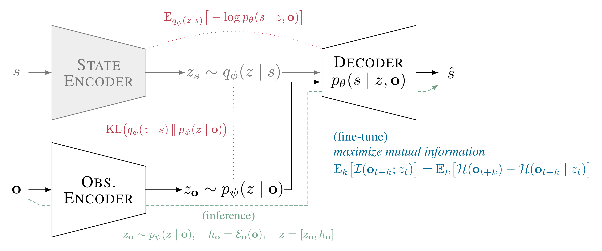
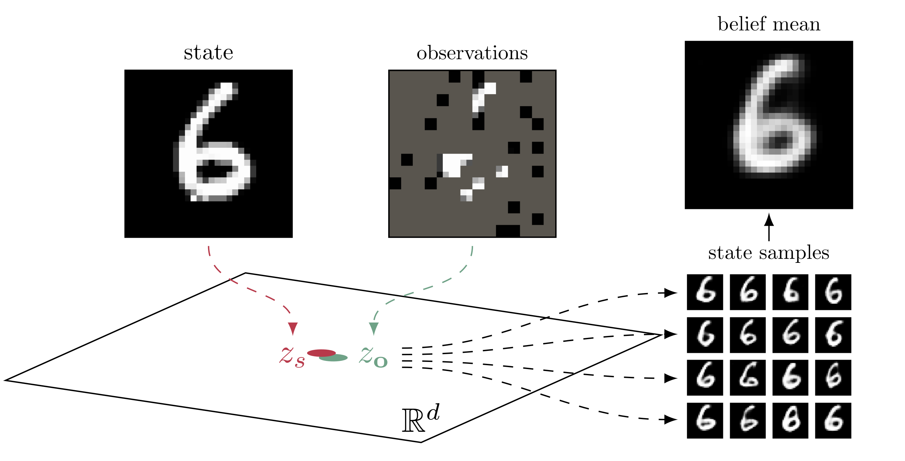

# I-VAE

PyTorch implementation of the _inversion variational autoencoder (I-VAE)_.

    <picture>
        <source media="(prefers-color-scheme: light)" srcset="./media/ivae-light.png">
        <source media="(prefers-color-scheme: dark)" srcset="./media/ivae-dark.png">
        
    </picture>

Example applied to MNIST given partial pixel observations.

    <picture>
        <source media="(prefers-color-scheme: light)" srcset="./media/mnist-light.png">
        <source media="(prefers-color-scheme: dark)" srcset="./media/mnist-dark.png">
        
    </picture>

Other examples applied to geological inversion, used as a way to update a POMDP belief through posterior state samples.

## Citation
_In progress._
