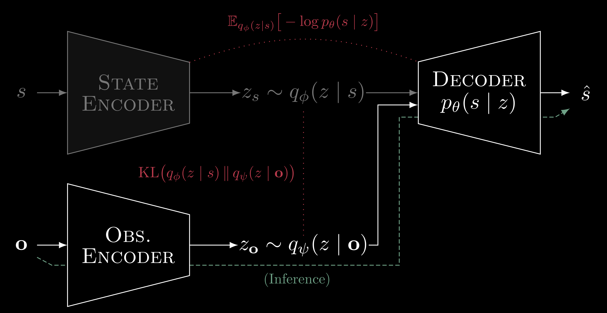
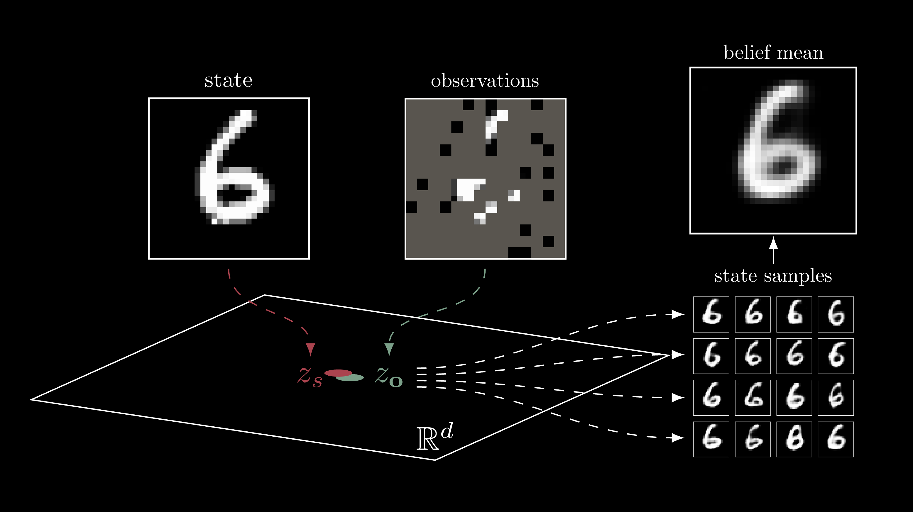

# $\mathcal{I}\text{-VAE}$

PyTorch implementation of the _inversion variational autoencoder (I-VAE)_.

<kbd>

    

</kbd>

Example applied to MNIST given partial pixel observations.

<kbd>

    

</kbd>

Other examples applied to geological inversion, used as a way to update a POMDP belief through posterior state samples.

## Citation
_In progress._
