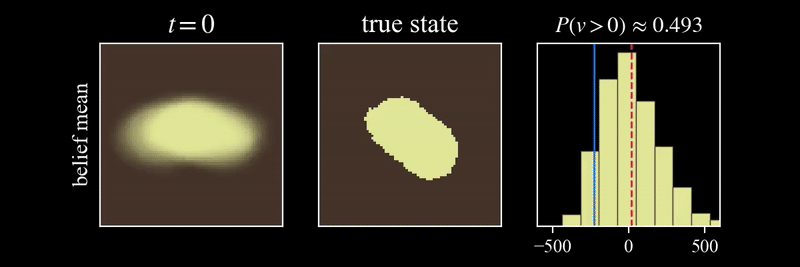

# I-VAE

PyTorch implementation of the _inversion variational autoencoder (I-VAE)_.

<p align="center">
    <picture>
        <source media="(prefers-color-scheme: light)" srcset="./media/ivae-light.png">
        <source media="(prefers-color-scheme: dark)" srcset="./media/ivae-dark.png">
        
    </picture>
</p>

## Installation
```sh
git clone https://github.com/sisl/I-VAE
cd I-VAE/ivae
pip install .
```

## Usage
```python
from ivae import IVAE, train

model = IVAE(state_channels, obs_channels, latent_dim, dropout_rate)
for epoch in range(epochs):
    train(model, dataloader, val_dataloader, optimizer, device, epoch, epochs)
```

Where `dataloader` holds tuples of `(state, obs)`. In the provided implementation, the state is an 80×80 tensor and the observations fill out a 200×200 tensor.

## Examples

Example applied to MNIST given partial pixel observations.

<p align="center">
    <picture>
        <source media="(prefers-color-scheme: light)" srcset="./media/mnist-light.png">
        <source media="(prefers-color-scheme: dark)" srcset="./media/mnist-dark.png">
        
    </picture>
</p>

Other examples applied to geological inversion, used as a way to update a POMDP belief through posterior state samples.

<p align="center">
    
</p>


## Citation
```
In progress
```
